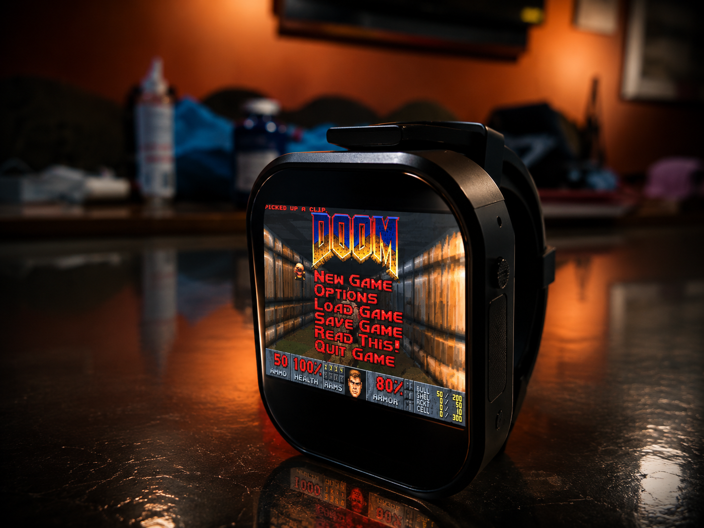

# DOOM Watch Launcher

- An SD-card-based DOOM launcher for ESP32-S3 touch AMOLED devices. Inspired by the classic DOOM.
- Support me on https://ko-fi.com/tsixom




## Features

- Clean, touch-optimized AMOLED interface
- Quick weapon switching via top-left tap

## Requirements

### Hardware

- ESP32-S3 Touch AMOLED 2.06
- https://www.waveshare.com/wiki/ESP32-S3-Touch-AMOLED-2.06

### SD Card

- FAT32 formatted
- Place `doom1.wad` in the root directory:

```text
/sdcard/doom1.wad
```

## Libraries Used

- Arduino_GFX_Library
- Arduino_DriveBus_Library
- doomgeneric

## Controls

### Launcher Controls

| Button | Action |
|---------|---------|
| PWR Button | Use |
| BOOT Button | Fire |

### In-Game Controls

| Input | Action |
|---------|---------|
| Touch top-left corner | Cycle weapons |
| Touch top-right corner | Menu |
| Touch anywhere else (drag) | Move / Turn (invisible joystick) |
| BOOT + PWR together | Inject save-name macro |

## Credits

### DOOM Engine

- Original DOOM
- Chocolate Doom / doomgeneric

### Libraries

- Arduino_GFX_Library
- Arduino_DriveBus_Library
- XPowersLib
